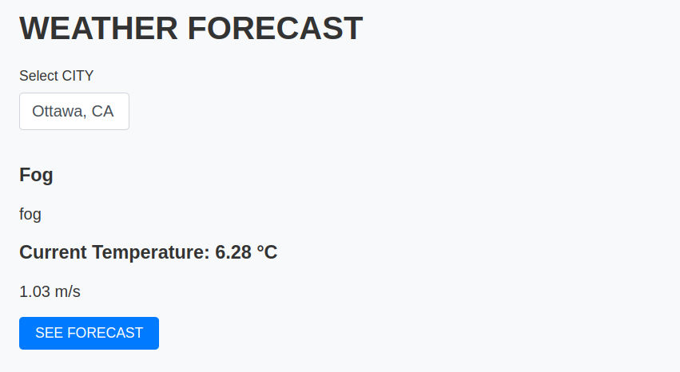
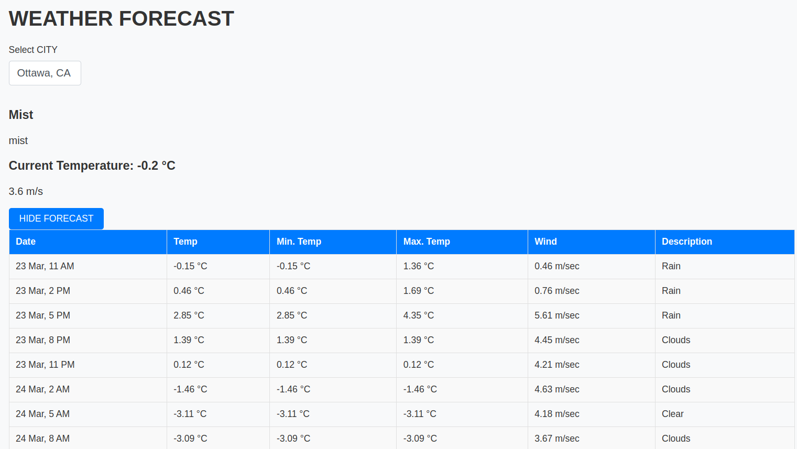
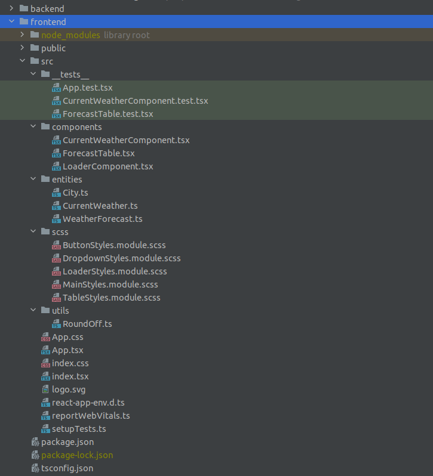
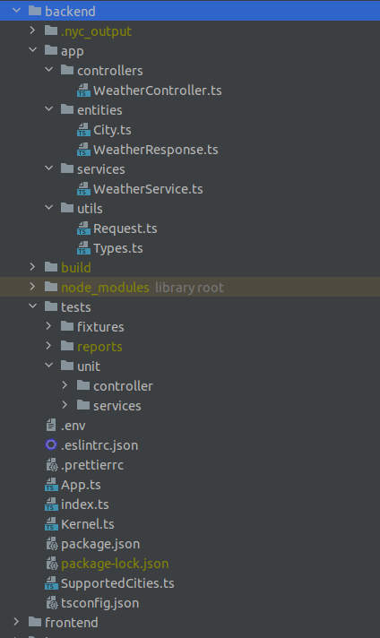

# WEATHER FORECAST APP

## How to run the application

From the root of the project run:

```sh
npm run install
npm run start

```

This should start the frontend at http://localhost:3000/
and backend at http://localhost:8181/

## How to run the tests

For frontend tests, from the root of the project run:

```sh
cd ./frontend
npm run test

```

For backend tests, from the root of the project run:

```sh
cd ./backend
npm run test
```

## Project Structure

The project separates frontend and backend into their respective folders with their own package.json files.

## Frontend

The frontend uses ReactJS and has only one page which uses multiple React Components and SCSS modules for styling.
One can select from a list of cities to fetch the current weather and also click on the `SEE FORECAST` button to get some weather forecast details.

### Some screenshots




## Backend

The backend uses Restify to create a REST API with following endpoints

- /supportedCities: Fetches the list of supported cities
    - Example output:
    ```json
      [
        {
            "id": 6167865,
            "name": "Toronto",
            "country": "CA"
        },
        {
            "id": 6094817,
            "name": "Ottawa",
            "country": "CA"
        },
        {
            "id": 1850147,
            "name": "Tokyo",
            "country": "JP"
        }
      ]
    ```

  - /current/:cityId: Fetches the current weather details
      - Example output:
      ```json
        {
            "weatherMain": "Rain",
            "weatherDescription": "moderate rain",
            "tempMax": 281.01,
            "tempMin": 278.35,
            "temp": 280.08,
            "windSpeed": 4.63,
            "date": "2023-03-23T14:37:56.000Z"
        }
      ```
- /forecast/:cityId: Fetches the weather forecast
    - Example output:
  ```json
        [
            {
              "weatherMain": "Rain",
              "weatherDescription": "moderate rain",
              "tempMax": 281.01,
              "tempMin": 278.35,
              "temp": 280.08,
              "windSpeed": 4.63,
              "date": "2023-03-23T14:37:56.000Z"
            },
            {
              "weatherMain": "Clouds",
              "weatherDescription": "overcast clouds",
              "tempMax": 279.45,
              "tempMin": 279.13,
              "temp": 279.45,
              "windSpeed": 3.93,
              "date": "2023-03-23T21:00:00.000Z"
            }
      ]
  ```


### Frontend project files structure:


### Backend project files structure




